# Delta X Labeling Software

## Description

The IMIU Image Labeling Software and its associated Python Server enable efficient data labeling for AI training. Labeled data produced by this software can be seamlessly integrated with AIX training applications, streamlining the machine learning process.

## Installation Instructions

### Download/Clone this repository

Clone or download this repository to access the Delta X Labeling Software and Python Server code.

### Enviroment preparation

* The server code is written in Python, so ensure that the Python environment is installed on your machine. If it's not already installed, you can refer to the official Python website at https://www.python.org/downloads/.
* After installing Python, you need to install the necessary Python libraries listed in the `requirements.txt` file by command `pip install -r requirements.txt`.

### Run server.py file

* Check your device IP adress and paste it in line 971 of `server.py` file. You can do this by go to the `Network and Internet Settings` of your computer and check the IPv4 address. Copy it and replace to the default IP address at line 971.

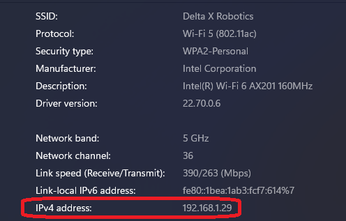

* Run the `server.py` file.

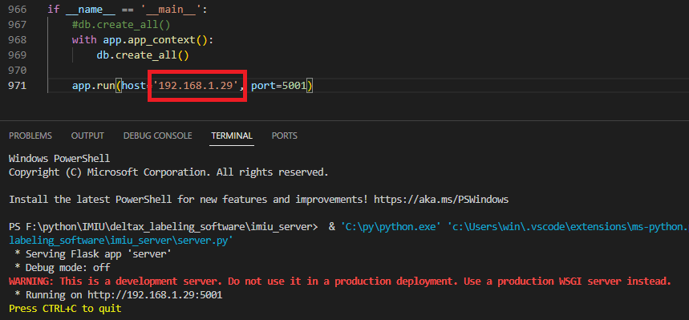

### Launch the IMIU software

* Run the software in `imiu_software` folder.
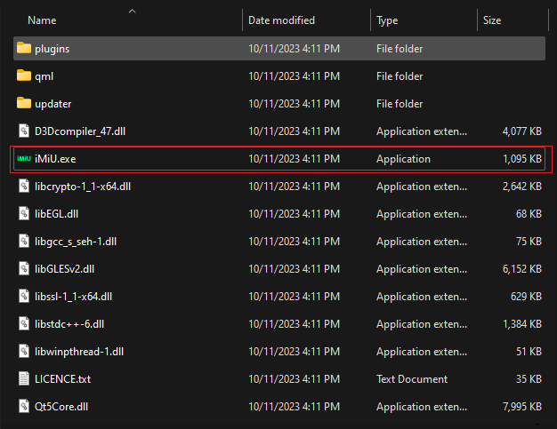

## Usage Instructions

### Software Admin Usage

#### Step 1: Change the IP address

Change the IP address to the IP address of the computer running the `server.py` file.

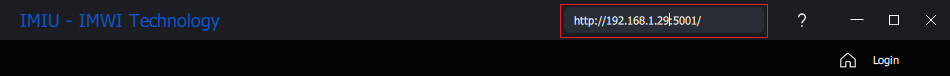

#### Step 2: Login admin account

* Log in to default admin account with username: `admin` and password: `123456`.

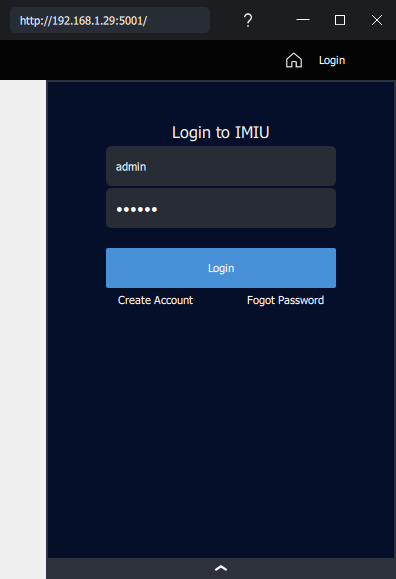

#### Step 3: Create Project

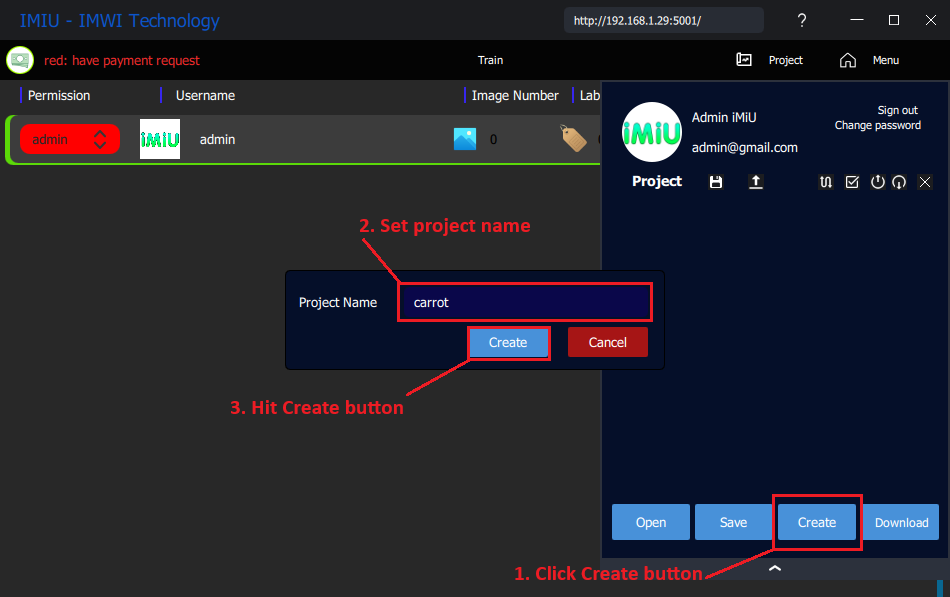

#### Step 4: Upload images

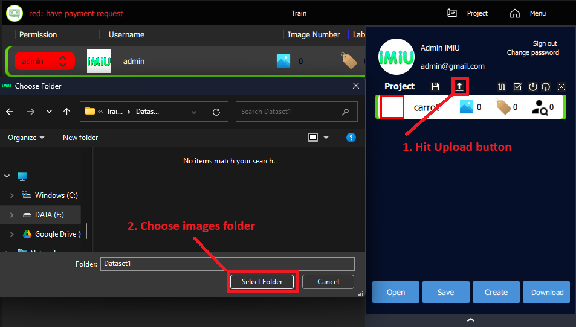

#### Step 5: Open project

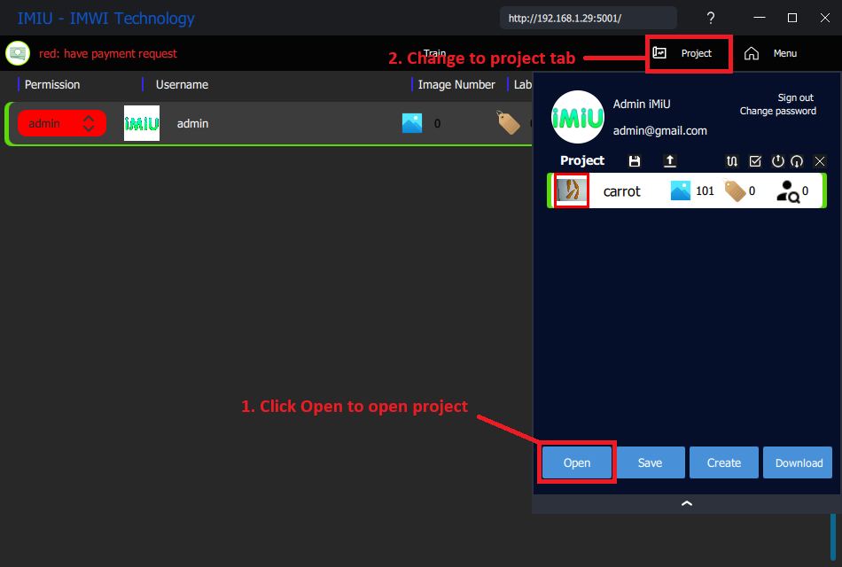

#### Step 6: Labeling

##### 1. Add class

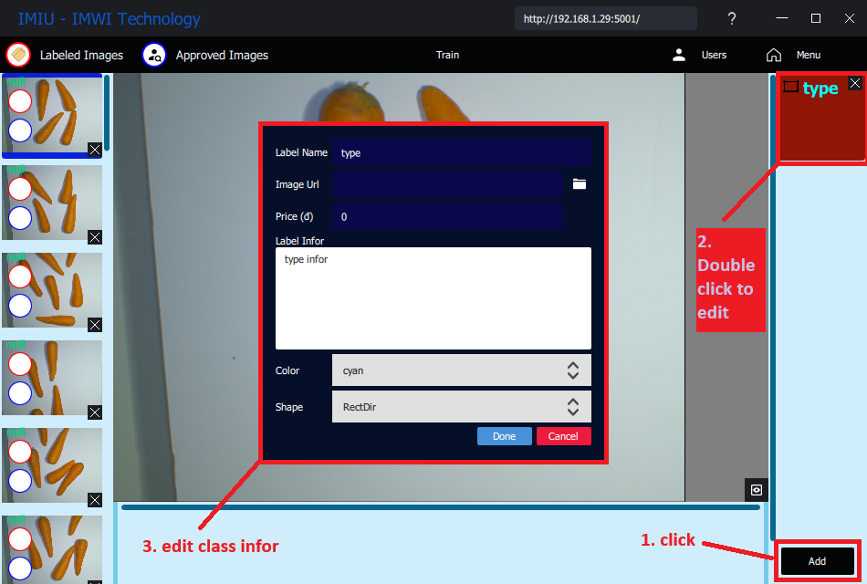

##### 2. Labeling

* Use left mouse to draw bounding box, right mouse to move the image and mouse wheel to zoom in/out the image.
* Rotate the bounding box by using the rotate button in the middle of the direction edge.
* Resize the bounding box by using the resize button in the corner of the bounding box.
* Select object class by click on the class name in the class list after drawing the bounding box.
* Save the project by click on the `Save` button in the dropdown `Menu`.
* Mark the image as done by check the labeled checkbox in the image list. The same if you approve the image.

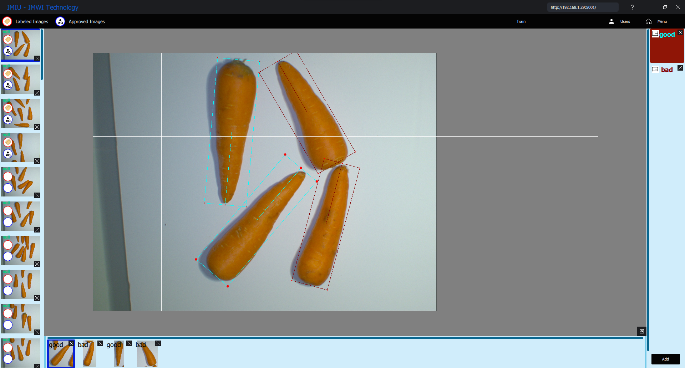

##### 3. Export data

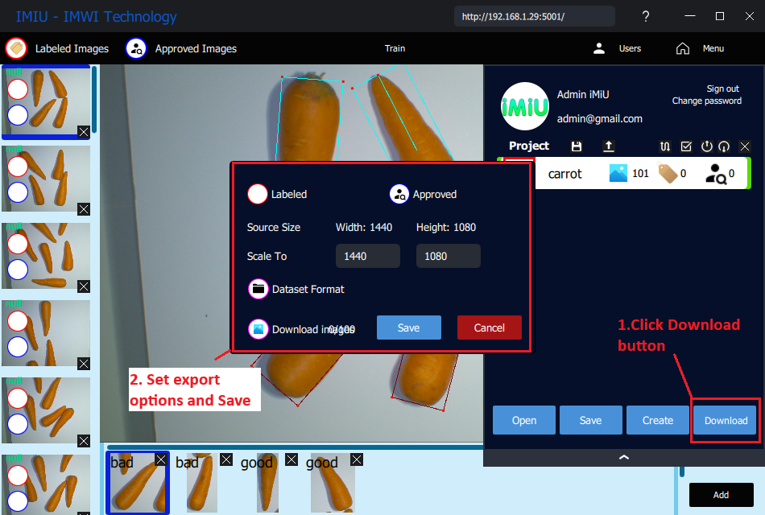

You can choose:

* Export labeled data or approved data.
* Resize the image to the desired size.
* Export like a dataset formart or not(only export bounding box data).
* Download the images or not.

